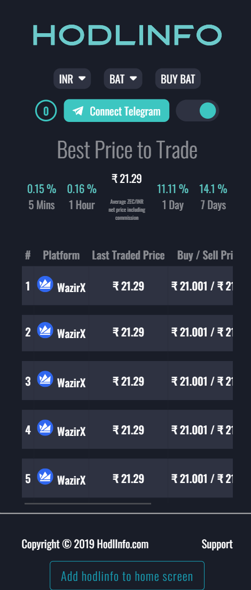

# Hodlinfo-clone

- This project is a clone of [hodlinfo](https://hodlinfo.com/) website.
- Shows stock information for 10 stocks.
- Switch between light and dark mode.

*Note:* sample.env file contains all the environmental variables names to be included in project.

[code](https://github.com/nkp1111/hodlinfo-clone)

## Table of Contents

- [Overview](#overview)
  - [Images](#images)
  - [Built With](#built-with)
- [How to use](#how-to-use)
- [Contact](#contact)
- [Acknowledgements](#acknowledgements)

## Overview

### Images

- Desktop View

  

- Tablet View

  

- Mobile View

  

### Built With

- Mongo
- Express
- Node

## How To Use

To clone and run this application, you'll need [Git](https://git-scm.com) and [Node.js](https://nodejs.org/en/download/) (which comes with [npm](http://npmjs.com)) installed on your computer. From your command line:

```bash
# Clone this repository
$ git clone https://github.com/nkp1111/chat-group-master.git

# Install dependencies
$ npm install

# Run the app
$ npm start
```

## Acknowledgements

- [Node.js](https://nodejs.org/)
- express
- mongoose
- path
- ejs
- axios
- dotenv

## Contact

- Website [Neeraj Parmar](https://portfolio-teal-six-33.vercel.app/)
- GitHub [nkp1111](https://github.com/nkp1111)
- Twitter - [@nkp11111507](https://twitter.com/@nkp11111507)
